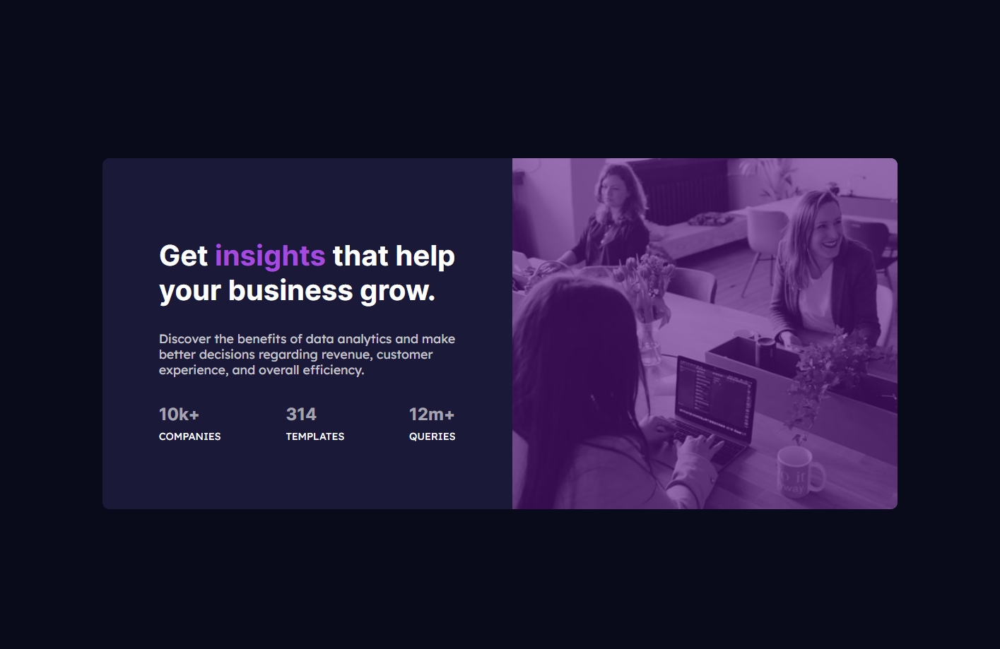

# Frontend Mentor - Stats preview card component solution

This is a solution to the [Stats preview card component challenge on Frontend Mentor](https://www.frontendmentor.io/challenges/stats-preview-card-component-8JqbgoU62). Frontend Mentor challenges help you improve your coding skills by building realistic projects. 

## Table of contents

- [Overview](#overview)
  - [The challenge](#the-challenge)
  - [Screenshot](#screenshot)
  - [Links](#links)
- [My process](#my-process)
  - [Built with](#built-with)
  - [What I learned](#what-i-learned)
  - [Continued development](#continued-development)
  - [Useful resources](#useful-resources)
- [Author](#author)
## Overview

### The challenge

Users should be able to:

- View the optimal layout depending on their device's screen size

### Screenshot
- Screenshots were taken in the widths indicated by the style guide (1440px, 375px)

### Links

- Live Site URL: [https://morbitdemon.github.io/stats-preview-card-component-main/](https://morbitdemon.github.io/stats-preview-card-component-main/)

## My process
- Built the HTML structure.
- Buit the Mobile design.
- Added complexity and changed layout for desktop.

### Built with

- Semantic HTML5 markup
- CSS custom properties
- Flexbox
- Mobile-first workflow
- Media queries

### What I learned
 Add a overlay color to an image
### Continued development

- Mobile first design
- Responsive design

### Useful resources

- [Add color overlay to an image](https://www.youtube.com/watch?v=uLvhAJfx3T0) - This helped me add an overlay color to my images.
## Author

- Frontend Mentor - [MorbitDemon](https://www.frontendmentor.io/profile/MorbitDemon)
